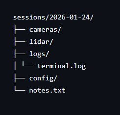
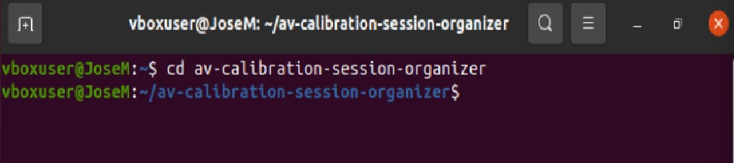
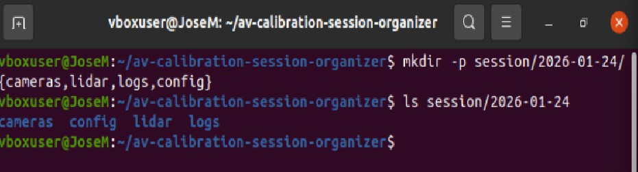
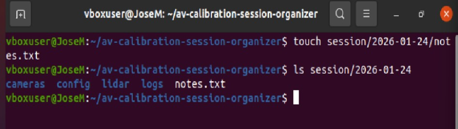
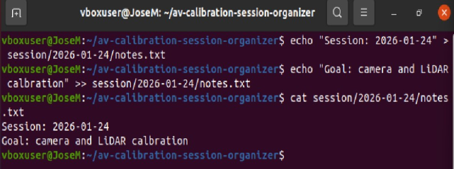
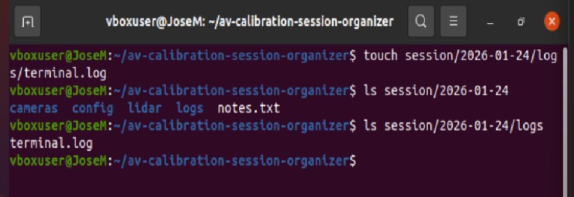

## Real Project: Calibration Session Organizer

Goal: store every calibration session by date using a clean and repeatable structure for camera and LiDAR data.

Final structure created for one session:

### Step 1 – Go to project folder

### Step 2 – Create dated session folders

### Step 3 – Create session notes file

### Step 4 – Write session information

### Step 5 – Create a log file

### Step 6 – Verify the final structure

